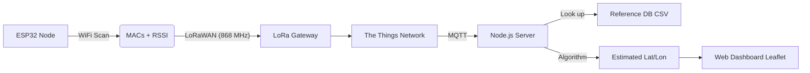

# 📍 WiFi Sniffing & LoRaWAN Geolocation

A **GPS-free geolocation system** that estimates the position of an ESP32 node by scanning surrounding WiFi Access Points (WiFi Sniffing), transmitting the data via **LoRaWAN**, and calculating the location using a **Weighted Centroid** algorithm based on RSSI strength.

## 📖 Project Overview

The goal of this project is to track the trajectory of a device in an environment where GPS is unavailable or power-hungry. The system relies on a pre-built database of known WiFi Access Points (fingerprinting/mapping) to triangulate the device's position.

### Key Features
* **WiFi Sniffing:** Passive scanning of MAC addresses (BSSID) and Signal Strength (RSSI).
* **LoRaWAN Communication:** Long-range, low-power transmission of scanned data to The Things Network (TTN).
* **MAC Filtering:** Automatic filtering of randomized/mobile MAC addresses to ensure accuracy.
* **Real-time Visualization:** Web interface with a live map (Leaflet.js) showing the estimated trajectory.
* **Smart Fallback:** Weighted Centroid algorithm to estimate position based on signal proximity.

---

## 🏗️ System Architecture


## 🛠️ Technologies & Hardware

### Hardware
* **Microcontroller:** ESP32 (Dev Module).
* **Communication Module:** LoRa-E5 (Grove or similar LoRaWAN modem).

### Software Stack
* **Firmware:** C++ (Arduino IDE) with `WiFi.h` and AT Command handling.
* **Network Server:** The Things Network (TTN) v3.
* **Backend:** Node.js (Express, MQTT.js, CSV-Parser).
* **Database:** CSV-based Reference Database (Derived from WiGLE).
* **Frontend:** HTML5, Leaflet.js (OpenStreetMap).
* **Utilities:** Python scripts for data cleaning and database fetching.

---

## 🚀 Installation & Setup

### 1. Prerequisites
* Node.js & npm installed.
* Python 3.x installed (for DB scripts).
* Arduino IDE with ESP32 board support.
* A The Things Network (TTN) account.

### 2. The Reference Database
The system needs to know where the WiFi routers are located.
1.  Export data from **WiGLE WiFi Wardriving** app (Android) or use a Python script to fetch data from the WiGLE API.
2.  Place your raw CSV file in the root folder.
3.  Run the converter script to format it for the server:

```bash
python formatDB.py
```
### 3. Firmware (ESP32)
1.  Open the .ino file in Arduino IDE.

2.  Update your LoRaWAN credentials.

3.  Upload the code to the ESP32.

### 4. The Things Network (TTN) Configuration
1.  Create an Application and register your Device.

2.  Go to Payload Formatters > Uplink and select Custom Javascript.

3.  Paste the provided decoder script (decodes the 7-byte chunks: 6 bytes MAC + 1 byte RSSI).

 ### 5. Backend Server (Node.js)

1.  Navigate to the project folder.

2.  Install dependencies:

```bash
npm install mqtt express csv-parser cors
```

3.  Edit server.js with your TTN Application credentials.
   
4.  Start the server

## 🖥️ Usage

1.  **Start the Server:** Ensure `node server.js` is running. You should see "Connected to TTN".
2.  **Open the Dashboard:** Go to `http://localhost:3000` in your browser.
3.  **Power the Device:** Turn on the ESP32.
4.  **Visualize:**
    * The ESP32 scans WiFi networks.
    * It filters out mobile hotspots and sends the strongest fixed APs via LoRa.
    * TTN forwards the payload to your Node.js server via MQTT.
    * The server matches MAC addresses against `dbform.csv`.
    * The server calculates the estimated position and updates the map in real-time.

---

## 🧮 How the Algorithm Works

We use a **Weighted Centroid** approach rather than strict trilateration, as RSSI is noisy.

$$Lat_{est} = \frac{\sum (Lat_i \times w_i)}{\sum w_i}, \quad Lon_{est} = \frac{\sum (Lon_i \times w_i)}{\sum w_i}$$

Where the weight $w_i$ is inversely proportional to the estimated distance $d$:

$$w_i = \frac{1}{d_i^{n}}$$

* **RSSI to Distance:** Calculated using the Log-Distance Path Loss Model.
* **Result:** The closer the node is to a router (stronger signal), the more "pull" that router has on the estimated position dot on the map.

---

## 📝 Author

**Flávio Rosim de Sousa** 

## 📄 License

No License provided.
